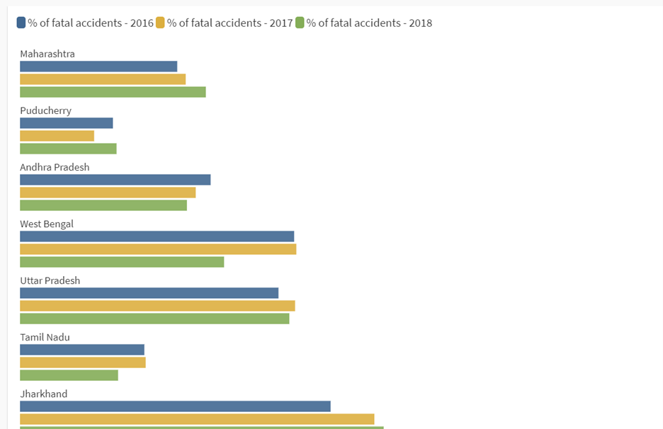
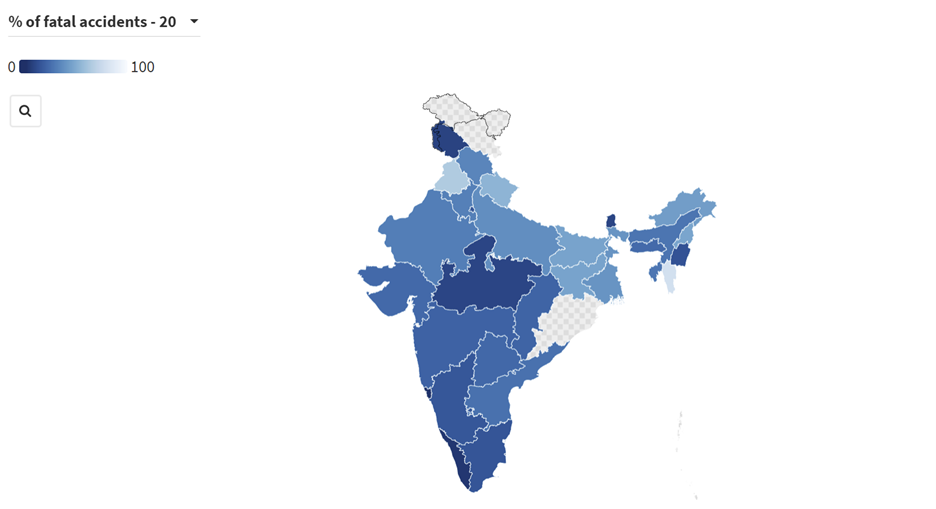

## Redesigning the Fatal accidents graphic

While selecting the visualization, I really wanted to take a viz that reaches out to a huge number of people and displays relevant information to the public. Hence, the chosen viz is from the website of government of India that displays the total number of fatal accidents according to the states and Union Territories. This is the most widely reachable visualization and has not been critiqued by people. 

[Link to viz](https://visualize.data.gov.in/?inst=5c768e13-f1ce-4a84-a276-a03be6b918bd&vid=100261)

### Critiquing

During the critiquing process, I had a closer look at the visualization that forced me to look at the viz from different angles. The journey started from seeing if the visualization was intuitive and easy to interpret for the normal public. This revealed that the viz was representing the objective number of fatal accidents that took place according to the states. This could very well be misleading as the viz did not take into consideration the total number of accidents occurring and the map could therefore give a wrong impression regarding the road safety of the states. Hence, the first major step consisted of providing the right data to portray the correct story. 

Hence, I went out to find the total number of accidents that have been taking place across the states of India so that we can represent the fatal accidents by the percentage of total occurring accidents that would provide a much better view of the safety of states. Hence, I did some data manipulation using excel.
Next, the graph was getting cluttered by the name of the states written on the graph making it hard to read. The name of the states was overlapping with other states and the text was written in black color which was not the best color choice. Hence, I decided to remove the names of the states from the map and only display the names and the exact figures when you hover over the particular state. 
The interactivity of the graph was also not up to the mark. There was a small timeline at the bottom of the graph to view the map for different years but on hovering over the labels, it was only displaying one year that made it very confusing for the viewers. Therefore, I decided to change the interactivity by using a small drop down at the top of the chart to select the year which makes it very clear.
I also wanted to experiment with showing the data the other way around, which means, that showing the safest countries with dark blue color and the least countries with light blue and changing the heading of the chart as the safest states in India when we compare road accidents. Another experiment that I did was to show theses fatal road accident percentages in a bar chart instead of a map. This might make it clearer to check the safest states and it will also ignore the area of the states making the message more accurate and less misleading.

### Feedback

Person 1:
The bar chart does give a better comparison of the percentage of road accidents that occurred over the years but the map provides a much better picture of the layout of the states. The map would be the better option as you can know the area and the safety metric in an easy to interpret manner. There is less energy spend while reading the map. The title of the graph should be made more clear.

Person 2:
I would prefer the map over the bar chart if the comparison between the years is not the most important objective of the viz.
The blue color scheme showing the safety of the states is not a very accurate representation compared to the map showing the most dangerous states in red. The red will give out a strong message and will be easy to grasp.

### Redesign

According to the feedback received, I decided to go ahead with the map instead of the bar chart for good reasons. First, the motive of this viz is to provide the most accident-prone states of India and the map does that for us in an easy to interpret and easy manner. The map gives us the extra advantage of also seeing the regions in the graph according to the road accidents (For example, is the southern part of India more safer than the northern part of the country). The comparison over the years is not the main objective and hence, that option is available to the users using a easy to use drop down menu to select the years.
Also, instead of reversing the color scheme and displaying the blue color for the safest states, it is better to show the most accident prone states in dark red. This provides a more important and strong message and also complies with the title of the viz better.

[Link to my final viz](/roadaccidentsfinal.md)
